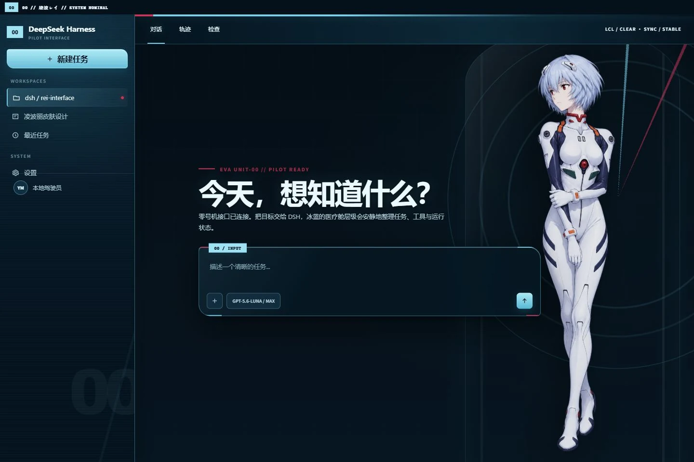

# dsh-skin-rei

[English](README.en.md) | 简体中文

面向 DSH Web UI 的凌波丽 / EVA 零号机主题皮肤。设计语言采用雾白、冰蓝、深海军蓝、医疗舱玻璃和极少量红色焦点。



## 特性

- 欢迎页显示完整凌波丽立绘、UNIT-00 同步环和医疗舱玻璃效果。
- 进入对话后立绘自动退到右侧并降低透明度与饱和度，避免影响阅读。
- 独立设计亮色、暗色、设置弹窗、菜单、终端、消息和禁用状态。
- 适配宽屏、窄屏和系统“减少动态效果”设置。
- 切换皮肤时完整回收 DOM、观察器、标题、favicon、主题色和内联布局变量。
- 角色素材内嵌于客户端包，不依赖远程图片服务。

## 安装

将本目录作为 DSH Web 插件安装，然后在 `设置 > 皮肤` 中选择 `凌波丽 · UNIT-00`。

## 开发与验证

```sh
pnpm install --config.auto-install-peers=false
node scripts/sync-art.mjs
node scripts/sync-client-bundle.mjs
node node_modules/vitest/vitest.mjs run
```

## 许可与声明

代码使用 MIT License。凌波丽与《新世纪福音战士》相关角色及设定归其各自权利方所有。本仓库是非官方同人主题，与相关权利方无关联。详见 [NOTICE](NOTICE)。
